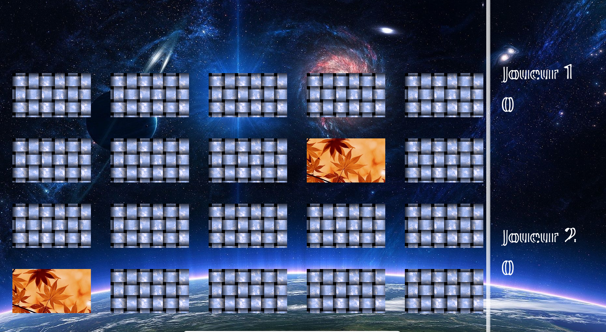

# Memory /w SDL2 Graphics
---
## Authors: Raphael Dray.
---
> This program is a Memory Game.
> It can be opened in a window using **SDL2**.

> It's written in __C language and SDL2 Library__.
> It's for an engineering school **project C**.

---
### Main menu:

### In-game:

### [READ THE LICENSE]()
